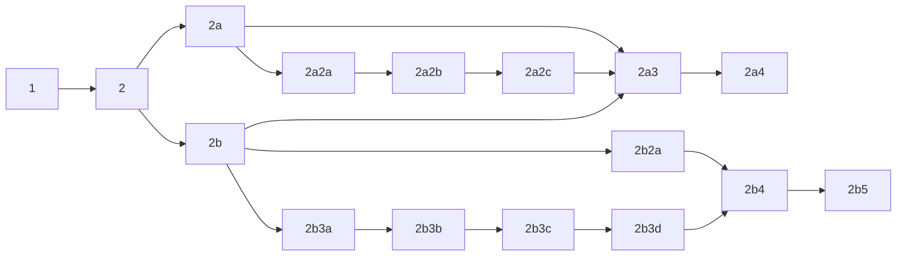

<<<<<<< HEAD
# python-fomulario
=======
<a href="https://www.linkedin.com/company/tsoft/" target="_blank"></a>
<a href="https://www.linkedin.com/in/ezequiel-nicolás-starecinch" target="_blank"></a>

<h1 align="center"> Formulario básico en Python </h1>
<h3 align="center"> Usando la librería "PyQt5" </h3>

<!-- TABLE OF CONTENTS -->
## Index
<details open="open">
  <summary>Tabla de contenidos: </summary>
  <ol>
    <li>
      <a href="#about-the-project">Sobre el proyecto.</a>
      <ul>
        <li><a href="#project-overview">Resumen del proyecto.</a></li>
        <li><a href="#built-with">Desarrollado con.</a></li>
      </ul>
    </li>
    <li>
      <a href="#installation">Instalación.</a></li>
      <ul>
        <li><a href="#2-1">Diagrama de flujo.</a></li>
        <li><a href="#2-2">Diagrama de flujo con el nombre de las ventanas.</a></li>
        <li><a href="#2-3">Diagrama de flujo con imágenes de las ventanas.</a></li>
      </ul>
    </li>
    <li>
      <a href="#stages-overview">Partes del proyecto.</a></li>
    </li>
    <li>
      <a href="#productionization">Productividad.</a>
    </li>
    <li>
      <a href="#images">Imágenes.</a>
    </li>
  </ol>
</details>


<!-- ABOUT THE PROJECT -->
## Sobre el proyecto:
<!-- PROJECT OVERVIEW -->
### Resumen del proyecto:

Se busca preparar una interfaz gráfica que le permita al `USUARIO` dejar todo listo para correr un robot, sin complicaciones.

Este formulario permirá:
* Elegir opciones de ejecución (sobretodo si el proceso está divido o se quieren correr diferentes robots)
* Archivo Txt: Modificar archivo txt en la misma interfaz gráfica del formulario
* Archivos Excel: 
  - Seleccionar por medio de un Explorador de Carpetas.
  - Archivos Excel: Verificar condiciones que debe cumplir el nombre.
  - Archivos Excel: Verificar que las planillas y las columnas del archivo estén de acuerdo a lo que el robot va a necesitar.
  - Archivos Excel: Mover el archivo. Verificar que el destino sea accesible.
  - Archivos Excel: Abrir archivo.
  - Archivos Excel: Sobreescribir archivo con la información del formulario.


<!-- BUILT WITH -->
### Desarrollado con:
* **Python Version**: 3.10.4
* **Packages**: PyQt5, pandas, os, calendar, datatime, locale.


<!-- INSTALLATION -->
## Instalación 
Clonando el repo
   ```sh
   git clone https://github.com/--------
   ```
Instalar dependencias:
- Crear un Environment:

   ```sh
   py -m venv env_formulario
   env_formulario\Scripts\activate
   ```

- Ejecutar en la carpeta del repo:
```sh
   pip install -r .\requirements.txt
   ```

Crear un ejecutable:
```sh
   pip install pyinstaller
   pyinstaller --windowed --onefile main.py
   ```


<!-- stages overview -->
## Partes del Proyecto:
<!-- 2-1 -->
### Diagrama de flujo.
A continuación se presenta el diagrama de flujo del formulario:


<!-- 2-2 -->
### Diagrama de flujo con el nombre de las ventanas.
A continuación se presenta el diagrama de flujo del formulario, pero con el nombre de las ventanas:



<!-- 2-3 -->
### Diagrama de flujo con imágenes de las ventanas.
A continuación se presenta el diagrama de flujo del formulario, pero con imágenes de las ventanas:
|||
|------------|------------|
|||
|||
|||

<!-- productionization -->
## Productividad:

>El formulario es completamente funcional y se puede adaptar fácilmente a otras tareas. 
>Se puede agregar fácilmente que trabaje con bases de datos. Pronto se subirá módulos para eso.
>Al hacer el ejecutable, las imágenes pegadas en el formulario no permanecen. Para que se vean las imágenes, deben estar en el path que se determinó (en este caso, debe estar en una carpeta "images" en la misma carpeta en que se encuentre el archivo .exe). Esto requiere un poco más de investigación.
>Probablemente es posible disparar el robot desde el mismo formulario. Esto requiere un poco más de investigación.


<!-- IMAGES -->
## Imágenes:


>>>>>>> 5ebbcb9 (Just finished working code with extra EXTRA comments)
